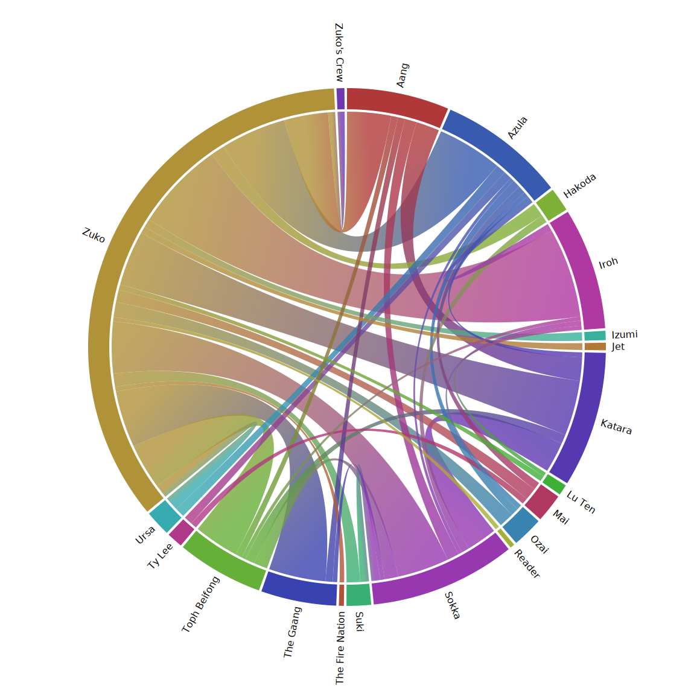

## Initial criteria

We'll cut off uncommon ship tags that fall below a certain frequency. For this analysis, I used the arbitary line of 50 works.

## Tags not counted

Some tags couldn't be included in this analysis. Firstly, tags that don't follow the canonical format of `Character Name (optional Fandom) <separator> ...`. These were:

- `Minor or Background Relationship(s)`
- `Zutara - Relationship`
- `Other Relationship Tags to Be Added`

Trust Zutara to be the ship that has to be different - won't somebody think of the data scientists _/s_. Out they go!

The other tags that don't fit with this method are the poly ships. I'd like to include them somehow, but I'm not sure how to without skewing/conflating the results. Excluded for now to make my life easier (sorry zukki)

- `Sokka/Suki/Zuko (Avatar)`
- `Aang & Toph Beifong & Katara & Sokka & Suki & Zuko`
- `Aang/Katara/Zuko (Avatar)`
- `Azula & Mai & Ty Lee`

## Duplicate tags

Having worked on data from user input before, I was expecting there to be much more deduplication work. There were only two duplicate sets of tags I found:

- `Aang/Katara (Avatar)` and `Aang/Katara`
- `Mai/Zuko (Avatar)` and `Mai/Zuko`

I didn't special case these, I just wrote the analysis such that it can handle duplicates.

## Nice looking graphs

I used the great [`chord` crate by **shahinrostami**](https://github.com/shahinrostami/chord_rs) to produce these outputs - the first for romantic, the second for platonic ships. Click for interactive versions!

FIXME FIXME FIXME

Link to interactive version here:
